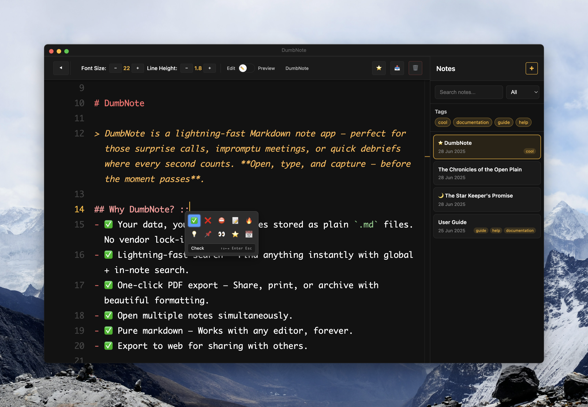

# DumbNote

> DumbNote is a lightning-fast Markdown note app — perfect for those surprise calls, impromptu meetings, or quick debriefs where every second counts. **Open, type, and capture — before the moment passes**.

## Why DumbNote?

- ✅ Your data, your format — Notes stored as plain `.md` files. No vendor lock-in, ever.
- ✅ Lightning-fast search — Find anything instantly with global + in-note search.
- ✅ One-click PDF export — Share, print, or archive with beautiful formatting.
- ✅ Open multiple notes simultaneously.
- ✅ Pure markdown — Works with any editor, forever.
- ✅ Export to web for sharing with others.

## Built for Flow

- **“just write.”**
- 🎯 Smart typing — Auto-complete lists, bullets, and checkboxes
- 🎯 Drag & drop everything — Images, PDFs, any file type as attachments
- 🎯 Live preview — See images and attachments inline while writing
- 🎯 Folding — Collapse sections for better document navigation
- 🎯 Quick emoji — Type `::` for instant emoji picker
- 🎯 Zen mode — Clean, dark, distraction-free writing environment
- 🎯 Markdown shortcuts — Bold, italic, code blocks with hotkeys
- 🎯 Tag filtering — Organize with #tags and filter instantly
- 🎯 HTML paste conversion — Copy from web, auto-converts to Markdown
- 🎯 Smart indentation — Perfect for code snippets and nested lists
- 🎯 Syntax highlighting
- 🚀 GitHub Gist integration — Publish notes as public/private Gists with one click

## Export Anywhere

- 📤 PDF export — One-click beautiful documents
- 📤 ZIP archive — Bulk export all notes + attachments
- 📤 Pure markdown — Works with any editor, forever

> No subscriptions. No cloud dependency. Just fast, reliable note-taking.
