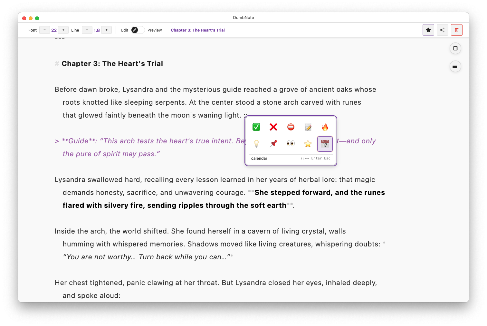

# DumbNote

> Lightning-fast markdown notes for surprise calls, quick meetings, and sudden ideas. **Open, type, capture — before the moment passes**.

## Download

[**Download DumbNote**](https://github.com/baibao577/dumbnote-page/releases/latest) for macOS, Windows, or Linux.

_macOS users: If you see a security warning, right-click the .pkg file and select "Open", then click "Install"._

## Why DumbNote?

**Your notes, your way**

- Plain `.md` files on your computer
- No vendor lock-in, no subscriptions
- Works offline, syncs when you want
- Compatible with any markdown editor

**Built for speed**

- Instant startup - no loading screens
- Lightning-fast search across all notes
- Smart shortcuts save keystrokes
- Multiple windows for parallel work

**Professional features**

- Monaco Editor (VS Code's editor)
- GitHub sync for backup
- PDF export with perfect formatting
- Publish to GitHub Gists instantly

## Key Features

### Writing

- **Smart typing** - Auto-continues lists and checkboxes
- **Wiki links** - Connect notes with `[[Note Name]]`
- **Quick dates** - Type `@today` for timestamps
- **Emoji picker** - Type `::` for quick emoji
- **Typewriter mode** - Keep cursor centered while writing

### Organization

- **Tags** - Organize with YAML frontmatter
- **Favorites** - Quick access to important notes
- **Hub View** - See how notes connect
- **Full-text search** - Find anything instantly

### Sharing

- **GitHub Gist** - Publish with one click
- **PDF export** - Professional documents
- **GitHub sync** - Automatic backup
- **Bulk export** - ZIP all notes

## Getting Started

1. **Download and install** DumbNote for your platform
2. **Create your first note** with `Cmd/Ctrl+N`
3. **Start typing** - it's just markdown
4. **Explore features** in our [User Guide](user-guide/index.md)

## Learn More

📚 **[Complete User Guide](user-guide/index.md)** - Master all features  
⌨️ **[Keyboard Shortcuts](user-guide/keyboard-shortcuts.md)** - Work faster  
🏷️ **[Organization Tips](user-guide/tags-favorites-hub.md)** - Stay organized  
☁️ **[GitHub Sync Setup](user-guide/github-sync.md)** - Never lose a note

## Philosophy

DumbNote follows one principle: **let you write**.

- No account required
- No feature bloat
- No artificial limits
- No data harvesting
- Just fast, reliable notes

Your notes stay on your machine, in standard markdown format, forever accessible.

**Repository**: https://github.com/baibao577/dumbnote-page

---

_Created by someone who just wanted to take notes without the hassle._
